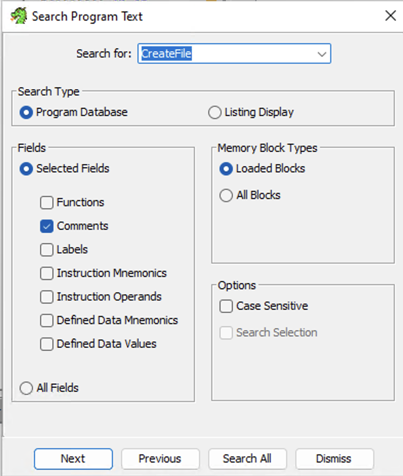

<center> <h2>Exploring a Suspicious File</h2>
2021350034 이주호</center>

## [1] Execute the target PE file properly. How did you do that?
이 문제는 ghidra를 사용하여 진행합니다. 우선 아무 조치도 하지 않은 PE파일을 실행하면 다음과 같은 문구를 볼 수 있습니다.


해당 string을 ghidra로 탐색해볼 수 있겠다고 생각했고, ghidra의 Defined Strings window에서 해당 문구를 볼 수 있었습니다.


해당 문자열을 사용하는 함수를 XREF기능을 통해 역참조하면, 그 문자열이 사용되는 함수와 어셈블리 코드를 확인할 수 있습니다.


따라서 해당 함수를 디컴파일 뷰어로 표시하면, c언어 형식으로 변환된 코드를 확인할 수 있습니다. 


그리고 'I need a valid name. Please find it for me'가 나타나는 조건을 탐색해 어떤 조건을 만족해야 이 과정을 건너뛸 수 있는지 생각해보게 되었습니다.


GetModuleFileNameA 함수의 경우 현재 실행되는 프로세스의 전체 경로를 받아오는 역할을 수행합니다. 첫 번째 인자로 현재 실행되고 있는 모듈의 핸들 혹은 NULL, 두 번째 인자로 실행 경로를 받아올 버퍼, 세 번째 인자로 두 번째에 들어간 버퍼의 길이를 명시합니다.

다음으로 GetFileTitleA 함수는 파일의 경로를 받아 파일의 이름을 출력하는 역할을 수행합니다. 첫 번째 인자로 파일의 이름 및 위치, 두 번째 인자로 파일 이름을 저장할 버퍼, 세 번째 인자로 두 번째 인자 버퍼의 크기를 받습니다.

이를 종합적으로 고려해보면 local_128에는 경로를 제외하고 현재 파일의 이름이 저장될 것을 알 수 있습니다. 그리고 iVar1이 0의 값을 갖기 위해선 그 파일의 이름이 local_250과 같아야 합니다.

local_250은 또 다른 함수 FUN_140001300에 의해 초기화됩니다.


이 함수는 총 6개의 함수로, (local_250, 0x14, 'JV(ul}h}bvXr(6<1D[', 0x14, 1, 4)가 파라미터로 전달되었을 때 어떤 값이 local_250에 저장되는지가 주요한 작업이므로 같은 역할을 수행하는 파이썬 코드를 만들어 이를 알아보고자 했습니다.

```py
def func1(p2, p3, p4, p5, p6):
    print("decoded p1 : ",end="")
    k=0
    if(p2 == p4):
        for i in range(p2-1):
            k = ord(p3[i]) ^ p5 ^ (i*p6//2)
            print(chr(k),end='')
    print()
    return True

func1(0x14, "JV(ul}h}bvXr(6<1D[@", 0x14, 1, 4)
```

FUN_140001300은 plaintext를 저장할 버퍼, 버퍼의 길이, ciphertext, ciphertext의 길이, 암호를 해독하는 데 필요한 변수 두 개를 파라미터로 받습니다.

우선 plaintext와 ciphertext의 길이가 같아야 하고, 그 길이만큼 반복문을 진행하며 복호화 문자를 생성합니다. p5와 i*p6//2를 ciphertext의 각 문자와 xor연산하여 복호화 문자를 얻어냅니다.

복호화가 완료되면, 다음과 같은 문자를 확인할 수 있습니다. 


해당 문자열을 파일 이름으로 하여 실행하면 다음 단계로 넘어갈 수 있습니다.


# [2] Execute the target PE file properly. How did you do that?
이 문제는 ida로 진행합니다. 올바른 파일 이름으로 변경 후 파일을 실행하면, 다음과 같은 문자열을 볼 수 있습니다.


ida로 해당 문자열을 탐색하여 어느 부분에서 이 문자열을 사용하는지 알아보도록 하겠습니다. ALT+T 단축키를 통해 파일 내에 존재하는 문자열을 검색할 수 있습니다.


그러면 해당 문자열을 사용하는 함수를 찾을 수 있고, f5를 눌러 클라우드 기반 디컴파일을 실행할 수 있습니다.


디컴파일 된 함수를 살펴보면, GetModuleFileNameW함수를 이용해 1번과 마찬가지로 실행중인 프로세스의 전체 경로를 불러옴을 알 수 있습니다. 다음으로 CreateFileW함수의 결과를 hFile에 저장하는데, CreateFileW는 파일 경로, 접근 권한, 공유 방식, 보안 속성, 파일 생성 방식, 파일 속성, 템플릿 파일 핸들 순서대로 총 7개의 파라미터를 갖습니다. 따라서 
1. 프로세스 실행 경로를 파일 경로로 가지며,
2. GENERIC_READ와 GENERIC_WRITE 권한을 모두 부여하고,
3. 다른 프로세스가 접근하지 못하도록 하며, 
4. 보안 속성을 지정하지 않고,
5. 파일이 있는 경우에만 해당 파일을 열고,
6. 일반 파일 속성을 가지며,
7. 템플릿 파일을 사용하지 않은 상태로 CreateFileW를 실행하게 됩니다.

함수가 종료되면 해당 파일의 핸들을 hFile에 저장합니다. 이 hFile은 이후 GetFileSize에 사용됩니다. GetFileSize는 파일 핸들과 추가 포인터를 파라미터로 받고, 파일의 크기를 리턴합니다. 파일 크기가 너무 큰 경우 상위 dword가 추가 포인터에 저장됩니다. 이 경우는 null로 설정되어 있습니다.

따라서 현재 프로세스의 파일 크기가 FileSize에 저장됩니다. 문자열이 발생되는 조건은 FileSize%0x200이 0이 아닌 경우입니다. 다음 단계로 넘어가기 위해서는, PE파일의 크기가 0x200 (512)바이트의 배수로 이루어져 있어야 합니다. PE파일의 byte를 수정하기 위해 PE bear로 PE파일의 정보를 탐색합니다.


파일의 크기가 317456으로 0x200의 배수가 아님을 알 수 있었습니다. 간단하게 317456 % 0x200의 연산을 해보면, 16의 값이 나오는 것을 알 수 있습니다. 16바이트만큼의 크기를 줄이거나 496바이트 만큼의 크기를 늘려 두 번째 조건을 통과할 수 있음을 알 수 있었습니다.


또한 PE파일 내에는 오버레이 섹션이 존재했습니다. 실행 파일의 기본 구조나 동작에 영향을 미치지 않으며, 추가적인 데이터를 포함할 수 있는 장소로 활용됨을 알 수 있었고 이 공간을 496바이트 만큼 늘릴 수 있겠다고 생각했습니다. hxd로 해당 공간을 늘렸습니다. 0x800+0x200-16의 값은 0x9f0이므로 이 부분까지 널 바이트로 채웠습니다.


그러면 파일의 크기가 0x200배수로 나누어 떨어지는 것을 확인할 수 있습니다. 이대로 프로그램을 실행하면, 예상했던 대로 다음 단계로 넘어갈 수 있습니다.


# [3] Verify your inputs by pressing the ‘Run’ button. How did you do that?
이 문제는 ghidra로 진행합니다. 먼저 프로그램을 보면, 일반적으로는 unverified되어 추가적인 절차가 필요한 것으로 보입니다. dialog에 나타나는 문자열을 검색해, 관련된 함수를 먼저 찾아보고자 했습니다.


Defined Strings window에서 해당 문자열을 찾아낼 수 있었고, XREF를 따라 문자열을 사용한 함수로 이동할 수 있었습니다.

이후 decompile window에서, c언어 형식으로 디컴파일 된 소스 코드를 확인할 수 있습니다.


그리고 verify 조건과 관련된 함수의 주요 코드는 다음과 같습니다.


코드의 진행 과정을 순서대로 살펴보면, GetModuleFileNameW 함수를 통해 실행되는 프로세스의 경로를 local_438에 저장합니다. 이후 GetFileTitleW를 이용해 상위 경로를 제외한 프로세스의 이름만을 local_228에 저장합니다. 그리고 FUN_140009550의 결과를 iVar1에 저장합니다. FUN_140009550은 다음과 같이 동작합니다.


이 함수는 파라미터를 그대로 OpenClipboard 함수의 파라미터로 전달합니다. OpenClipboard는 클립보드에 대한 접근을 시작하는 데 사용되는 함수입니다. 파라미터로 클립보드 소유자 윈도우의 핸들이 들어가며, 떄문에 (HWND*)(param_1+8)을 전달했음을 알 수 있습니다. 함수가 정상적으로 실행되면, iVar1 != 0조건에 해당되어 if문 내의 동작을 진행하게 됩니다.
```cpp
local_4b0 = GetClipboardData(0xd);
```

GetClipboardData함수를 이용해 클립보드 내의 데이터를 가져오게 됩니다. 파라미터의 값은 데이터의 형식을 나타내며, 0xd의 경우 유니코드 데이터를 가져올 수 있습니다. 그리고 그 값을 local_4b0에 저장합니다.

```cpp
if (local_4b0 != (HANDLE)0x0) {
  local_4b8 = (wchar_t *)GlobalLock(local_4b0);
  local_4a8 = wcslen(local_4b8);
  if (local_4a8 < 0x20) {
    wcsncpy_s(local_478,0x20,local_4b8,local_4a8);
  }
  else {
    wcsncpy_s(local_478,0x20,local_4b8,0x1f);
  }
  GlobalUnlock(local_4b0);
}
```
local_4b0의 값이 null이 아니라면, GlobalLock 함수를 이용해 local_4b0에 해당하는 메모리 블록을 잠근 후 그 메모리 블록에 대한 포인터를 local_4b8에 저장합니다. 즉 local_4b8에서 유니코드 형식 클립보드 데이터에 접근할 수 있게 됩니다.

다음으로 local_4a8에 wcslen함수를 이용해 널 종료된 wide문자열(wchar_t형식)의 길이를 저장합니다. 그리고 만약 그 길이가 0x20보다 작다면 wcsncpy_s함수를 이용해 local_478에 local_4a8만큼 복사하고, 그렇지 않다면 0x1f만큼 복사합니다.

```cpp
iVar1 = wcscmp(local_478,local_228);
```
그리고 wcscmp함수를 이용해 wchar_t 문자열을 비교합니다. 프로그램의 실행 흐름에 따르면 local_478은 클립보드의 값이, local_228에는 프로세스의 이름이 저장되어 있을 것입니다. 아래 조건인 iVar != 0에 만족하면 unverified상태가 되므로 iVar == 0이기 위해 두 값이 같아야 합니다.

따라서 verified이기 위해서 프로세스의 이름(파일명)과 동일하게 클립보드 데이터를 가지고 있어야 함을 확인할 수 있습니다.


# [4] What is the full path of a file automatically generated?
생성되는 파일과 그 전체 경로를 알아보기 위해, 프로세스 모니터를 활용합니다. 원하는 프로세스를 확인하기 위해 CTRL+X 단축키로 먼저 clear한 후, 프로그램의 Run버튼을 누른 후 CTRL+E 단축키로 capture합니다.


다음으로 CTRL+L단축키로 필터링할 수 있습니다. Operation이 CreateFile인 경우를 확인하고 싶으므로, Operation is CreatFile로 필터링합니다.


생성된 파일의 전체 경로를 확인할 수 있습니다. C:\Users\User\AppData\Local\Temp\KU-DFRC-ReverseMe1-Happy-Weekend.json 입니다.

# [5] How many times in total was the file generated per button press?


Process Name이 KU-reverseMe1-!.exe, Operation이 CreateFile을 만족하도록 하는 필터를 건 후 RUN을 작동하면, CreateFile이 12번씩 작동하는 것을 확인할 수 있습니다. (실제 파일이 생성되는 횟수와는 다릅니다.) 그러나 CreateFile의 실행 횟수가 Student ID에 의존한다는 것을 곧 깨닫게 되었습니다. 


0은 8번, 1은 10번, 2는 12번, 3은 8번, 4는 10번 ... 이 반복됩니다. 실제 코드를 확인하기 전에, ID가 3으로 나누어 떨어지면 8번, 나머지가 1이면 10번, 나머지가 2면 12번과 같은 식으로 CreateFile이 실행되는 것으로 추측해볼 수 있었습니다.


추가적으로 캡쳐된 프로세스의 디테일을 살펴보면, Generic Write와 Delete(이후 소스코드의 DeleteFileW에 해당합니다.)가 짝지어 나타나는 것을 확인할 수 있었습니다. 따라서 캡쳐된 프로세스에는 파일의 생성과 삭제가 같이 존재하기 때문에 실제로 파일이 생성되는 횟수는 그것의 절반인 4번, 5번, 6번입니다. 제 학번인 2021350034를 입력하는 경우 파일은 총 6번 생성됩니다.

# [6] Identify and describe an algorithm that determines the number of times.

ghidra를 활용해 이 문제를 해결하고자 했습니다. 우선 CTRL+Shift+E 단축키를 이용해 프로그램 내에 존재하는 문자열을 검색하고자 했습니다. 찾으려는 함수가 CreateFile이므로 해당 함수를 검색합니다.




그러면 함수의 원 위치를 찾을 수 있고, XREF을 통해 이 함수를 call하는 다른 함수들의 위치를 찾을 수 있습니다. 그렇게 하여 RUN버튼 클릭 시 작동하는 주요 코드에 대해 확인할 수 있었습니다. 


또한 FUN_14000954e0의 내용은 다음과 같습니다.


4개의 파라미터를 그대로 GetDlgItemTextW에 전달합니다. 이 함수는 컨트롤 내의 텍스트를 가져오는데, 각 파라미터는 순서대로 핸들, 텍스트를 가져올 컨트롤의 ID, 텍스트를 저장할 버퍼, 버퍼의 최대 크기를 나타냅니다.

따라서 위와 같이 함수를 사용하면 local_5a8에는 Student ID 오른쪽 칸의 문자열이 저장되게 됩니다. 다음으로 wcstoul함수를 사용해 local_5a8에 있는 문자열을 부호 없는 정수로 변환하여 uVar2에 저장합니다. 각 파라미터는 문자열, 변환된 문자열 이후를 저장할 포인터, 변환할 숫자의 진법에 해당하므로 10진수 정수로 저장될 것입니다.

```cpp
for (local_5e8 = uVar2 % 3 + 4; local_5e8 != 0; local_5e8 = local_5e8 + -1) {
    hFile = CreateFileW(local_238,0x40000000,0,(LPSECURITY_ATTRIBUTES)0x0,1,2,(HANDLE)0x0);
    if (hFile != (HANDLE)0xffffffffffffffff) {
      pwVar7 = L"Hello, KU Students. Are you ready to become a Reverse-engineer?";
      pwVar10 = local_518;
      for (lVar5 = 0x80; lVar5 != 0; lVar5 = lVar5 + -1) {
        *(undefined *)pwVar10 = *(undefined *)pwVar7;
        pwVar7 = (wchar_t *)((longlong)pwVar7 + 1);
        pwVar10 = (wchar_t *)((longlong)pwVar10 + 1);
      }
      sVar4 = wcslen(local_518);
      WriteFile(hFile,local_518,(DWORD)((sVar4 & 0x7fffffff) << 1),local_5c8,(LPOVERLAPPED)0x0);
      CloseHandle(hFile);
    }
    DeleteFileW(local_238);
    Sleep(1000);
}
```
다음 for문을 살펴보면 uVar2 % 3 + 4의 값을 local_5e8에 저장하고, 값을 1씩 빼가며 0이 될때까지 반복하는 것을 확인할 수 있습니다. for문의 횟수만큼 CreateFileW이 작동하며 그 횟수는 StudentID값에 의존합니다. 입력된 string을 3으로 나눈 나머지에 4를 더한 횟수만큼 작동합니다. 

즉 정리하면 파일은 입력한 Student ID값을 10진수 정수로 변환한 값을 3으로 나눈 나머지 + 4만큼 생성됩니다. wcstoul에 의해, "2021350034"를 입력한다면 10진수 2021350034로 변환될 것입니다. 그것을 3으로 나눈 나머지는 2이며, 2 + 4 = 6만큼 파일이 생성되었던 것입니다.

# [7] Find a valid flag. 
이 문제는 ida로 해결하고자 했습니다. 임의의 값을 flag로 입력하면 다음과 같은 메시지를 확인할 수 있습니다.


ida에서 ALT+t 단축키를 이용해 해당 문자열을 탐색합니다.


그리고 이 문자열을 사용하는 함수를 찾아, 디컴파일합니다.


그리고 sub_1400094E0함수는 아까 Ghidra로 확인했던 FUN_14000954e0과 동일합니다. 4개의 파라미터를 모두 GetDlgItemTextW에 전달합니다.

```cpp
sub_1400094E0(a1 + 8, 1000i64, v9, 32i64);
sub_1400094E0(a1 + 8, 1004i64, v10, 32i64);
sub_1400094E0(a1 + 8, 1005i64, v8, 32i64);
```
따라서 이 부분에서는 v9에 이름을, v10에 학번을, v8에 flag의 값을 저장하는 것을 알 수 있습니다.

그리고 flag를 검증하는 함수는 다음과 같습니다.
```cpp
v3 = 17;
for ( i = 0; i < 26; ++i )
  {
    if ( LOBYTE(v8[i]) != (v3 ^ byte_14002C018[i * 2 / 2]) )
    {
      v5 = (_QWORD *)sub_140001EE0(v6, 128i64);
      v2 = (_QWORD *)__crt_unique_heap_ptr<unsigned char,__crt_internal_free_policy>::__crt_unique_heap_ptr<unsigned char,__crt_internal_free_policy>(
                       v7,
                       L"Hmm... You may need to do simple calculation.");
      sub_1400035C0(0i64, *v2, *v5, 32i64);
      return 0i64;
    }
    v3 = byte_14002C018[i * 2 / 2];
  }
```
0~25까지의 인덱스를 순회하며, flag를 구성하는 각 문자가 v3 ^ byte_14002C018[i * 2 / 2] 와 같은지 검사합니다. 그리고 각 v3은 매 반복문마다 byte_14002C018[i * 2 /2]값으로 변환됩니다. byte_14002C018은 다음과 같습니다.


만약 한 문자라도 같지 않다면, "Hmm... You may need to do simple calculation."을 출력하는 dialog를 발생시킵니다. flag를 얻기 위해 이를 복호화하는 코드를 만들었습니다.

```py
a = 17
b = [0x48, 0x0D, 0x5E, 0x7F, 0x52, 0x2B, 0x1B, 0x6E, 0x43, 0x25, 0x15, 0x60, 0x0E, 0x6A, 0x47, 0x26, 0x0B, 0x7D, 0x1C, 0x70, 0x19, 0x7D, 0x50, 0x3B, 9, 0x70, 2]
flag = []

for i in range(26):
    flag.append(chr(a^b[i]))
    a = b[i]

print("flag : ", end='')
for k in flag:
    print(k,end='')

print()
```
i * 2 / 2는 c언어에서 i와 의미상 동일하기 때문에, a^b[i]로 표현해도 같은 역할을 수행할 수 있었습니다. 이 코드를 설명하면 b에 들어있는 각 바이트를 그 이전값과 xor연산을 한 결과입니다. 따라서 다음과 같이 표현해도 값이 같습니다.

```py
b = [17, 0x48, 0x0D, 0x5E, 0x7F, 0x52, 0x2B, 0x1B, 0x6E, 0x43, 0x25, 0x15, 0x60, 0x0E, 0x6A, 0x47, 0x26, 0x0B, 0x7D, 0x1C, 0x70, 0x19, 0x7D, 0x50, 0x3B, 9, 0x70, 2]
flag = []

for i in range(26):
    flag.append(chr(b[i]^b[i+1]))

print("flag : ", end='')
for k in flag:
    print(k,end='')
```
출력값은 다음과 같습니다.


앞의 조건과 이 flag를 모두 맞추어 프로그램을 실행하면, correct!라는 문자열을 볼 수 있습니다.

